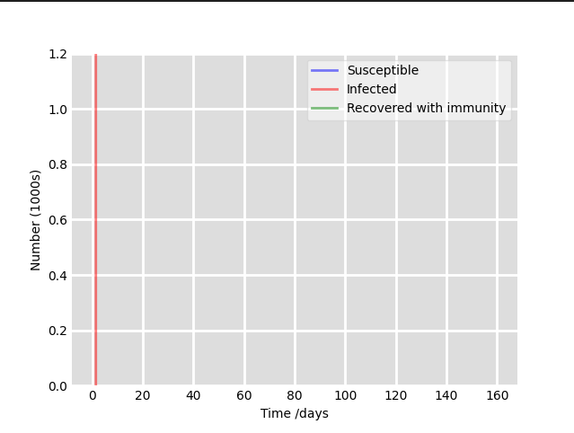

## Simulates the spread of typhoid fever in Sub-Saharan Africa over a one year period 

## Dependencies
- numpy 
- scipy 
- matplotlib 

You can install these using pip:

```bash
pip install numpy scipy matplotlib
```
## Usage 
- Run the simulate_diff.py script to perform the simulation and plot the results:  
1. Create the data by running `python3 src/data.py`, this creates a `data.txt` file which you can then read from. 
2. Run `python3 src/simulate_diff.py` This will display a plot showing the number of susceptible, infected, and recovered individuals over time. 

## Result 
 
## Contributing 
This is just a simple project I dared to work on after several days of Tyhpoid fever lol. Submit a PR if you're inspired enough. 

## Further Learning

To learn more about the SIR model and disease modeling in general, you might find the following resources helpful:

- [Compartmental models in epidemiology - Wikipedia](https://en.wikipedia.org/wiki/Compartmental_models_in_epidemiology)
- [The SIR epidemic model - Learning Scientific Programming with Python](https://scipython.com/book/chapter-8-scipy/additional-examples/the-sir-epidemic-model/)